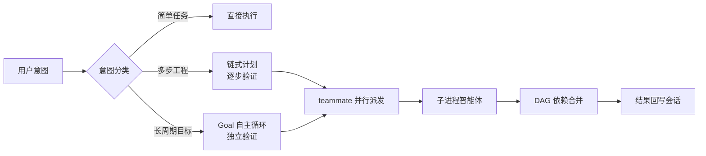

理解 Maestro Flow 的分层架构与核心概念，是深入使用与配置的基础。

---

## 三插件分层

**pi-maestro-flow** 由三个插件组成（装一个即得全部）：

| 插件 | 职责 | 一句话 |
|------|------|--------|
| **pi-maestro-flow** | 编排层与安装入口 | 目标/任务/计划、知识系统、MCP/LSP/浏览器/搜索 |
| **pi-maestro-teammate** | 执行引擎 | 并行子进程智能体、DAG 依赖图、模型路由 |
| **pi-cockpit** | 可视化状态 | 编辑器上方实时状态堆栈 + Starship 风格 Footer |

> 简言之：**flow 负责「编排与知识」，teammate 负责「并行执行」，cockpit 负责「看见」**。

## Pi 原生宿主归属（v0.31.3）

验证基线为 **Pi 0.99.0**；0.87–0.98 legacy 兼容严格版本门控，optional host peer `*` 范围不变。Pi 0.99+ 管理工具 loadout/`tool_search`、模型与 classifier runtime、MCP 和键盘能力。Maestro 只装饰自己注册的 namespace/exposure，尊重 CLI allowlist/禁用设置；缺少原生 API 不会启动第二套 legacy runtime。

MCP 使用原生 `/mcp` 与 `/mcp login <name>`；旧配置迁移前先禁用 `builtin:mcp`，用 `/maestro-mcp-migrate` 预览并批准，再恢复原生管理器。不能无损映射的配置会阻止迁移，而非静默丢弃。

Teammate 并行完成使用按任务 reservation 与父 dispatch 分组，处理早到 publication、foreground/detached 及 nested 交付；durable coordinator 可用时才提供持久交付，local non-durable 路径仍明确存在。Desktop target identity 含 sessionId、endpointId、processGeneration 与 normalizedCwd，并按 session/workspace 验证，不以窗口标签推测目标。

## 核心概念

### 工具面（Tool Surface）

- **工具面由宿主版本与 active/discovery 选择决定**
  - 调度：`teammate` · `teammate-send/list` · `observe`（watch/wait 为 opt-in legacy observation tools）
  - 编排：`maestro` · `goal` · `todo` · `run-control` · `plan-*`
  - 连接：原生 `/mcp`（legacy 才注册 Maestro `mcp`）· `lsp` · `browser` · `smart_search` · `search`/`fffind`
  - 其他：`bash_bg` · `ask-user-question` · `open-code-review`；原生 `tool_search`（legacy 才用 `search_tool_bm25`）

Plan 模式下额外激活 `plan-enter` / `plan-update` / `plan-review` / `plan-confirm` / `plan-exit` / `plan-status` 等只读规划工具。

### 搜索与评审

`search` 替代 `ffgrep`，支持 plain/regex/fuzzy 与 lines/files/count。限定 path 的搜索使用共享 FFF index；工作区根目录 plain/regex 搜索及索引不可用时走有界 rg。fuzzy 必须有索引；结果注明 engine、限制或超时时应缩小 path/glob，不能把部分结果当完整扫描。

`open-code-review` 依赖单独安装的 `ocr` CLI（包内 `optional/OCR-SETUP.md`）：`preview`/`rules` 无 OCR-side LLM，解析待审文件/规则后由宿主 agent 评审；`review` 由 OCR 管理评审、注入 runtime 模型配置，`health` 检查 CLI/模型连通性。模型配置入口为 `/api-manager open-code-review`；preview 不是已经完成的 code review。

### 执行模型



- **意图路由**：Maestro Flow 自动分类意图并路由到正确的执行通道。
- **并行派发**：一次派出多个子进程智能体并行工作，支持 DAG 依赖图。
- **生命周期**：Goal（长时目标）→ Plan（计划批准）→ todo（任务跟踪）→ Run（工作流运行控制）。

### 知识系统（Knowledge Gate）

任何代码访问或调度之前执行知识门：

```bash
maestro search "<查询>" [--type spec|knowhow|domain|issue] [--code]
maestro load --type <type> [--id <id>]
```

知识类型：`spec`（规范，按 arch/coding/debug/test/review/learning/ui 分类）、`knowhow`（经验配方）、`domain`（术语表）、`issue`（问题跟踪）、`roadmap`（里程碑）。详见[知识系统](/guides/knowledge)。

### 运行时子系统

| 子系统 | 作用 |
|--------|------|
| **Compaction 容量管理** | 上下文达到阈值自动修剪，防止长会话溢出 |
| **模型熔断与故障转移** | 电路断路器保护 API 调用，自动切备用模型 |
| **GUI 子系统（UCL）** | `PI_GUI=1` 启用，UCL（Unified Communication Layer，统一通信层）HTTP 工具发现/调用 + SSE 事件 |
| **TUI 界面组件** | Goal 面板、Todo 覆盖层、进度树、状态栏等 |
| **Gateway Board** | 工作区共享任务、claim lease、依赖、状态转换与 Session/Plan/Todo/endpoint 链接；通过认证的本地 IPC 访问，见 [Gateway Board](/guides/gateway-board) |
| **self-evolve 自进化层** | 运行轨迹 → 知识沉淀闭环（M1-M5：候选信号、评审门、健康侧车、提案治理、canary 验证），默认禁用（见 [Self-Evolve 自进化](/guides/self-evolve)） |
| **权限系统** | 5 种模式 + 细粒度 allow/ask/deny + 子进程 IPC 中继 |

### 后端注册表与系统指令

- **`.pi/SYSTEM.md` 单一权威**：项目系统指令仅来自 `.pi/SYSTEM.md`；此前内联打包的 `AGENTS.md` 注入已退役。依赖旧注入的项目须把相关内容迁移到 `.pi/SYSTEM.md`。
- **后端注册表路由**：teammate 派发不再走内联 `cli/<tool>` 派发，而是统一经 backend registry 路由（`cwd:remote:` 等位置感知派发同样经 registry）。`pi-maestro-backend-core` 提供纯契约包（能力表、凭据引用模型），具体后端（Pi subprocess、ACP-CLI、dsh）实现该契约。第三方适配器须实现 backend 契约而非依赖内联 `cli/<tool>` 派发。`outputSchema` 在宿主侧补偿，能力可由 `unsupported` 升为 `emulated`。

## 数据与配置文件位置

| 路径 | 内容 |
|------|------|
| `~/.pi/agent/settings.json` | 用户级设置（compaction、failover 等，`PI_CODING_AGENT_DIR` 可覆盖） |
| `<项目>/.pi/settings.json` | 项目级设置（覆盖用户级） |
| `~/.pi/agent/cockpit.json` | Cockpit 界面配置 |
| `~/.pi/agent/vision-delegation.json` | Vision 委托配置 |
| `~/.pi/agent/model-failover.json` | 模型故障转移配置 |
| `<项目>/.pi/SYSTEM.md` | 项目系统指令（单一权威；替代旧内联 `AGENTS.md` 注入） |
| `<项目>/.pi/gateway/v1/board/board.json` | Gateway Board 的工作区共享持久化状态；由 Gateway 管理，不应手工编辑 |
| `~/.pi/web-search.json` | Smart Search 原生路径配置 |
| `%LOCALAPPDATA%/smart-search/config.json` | Smart Search Python CLI 路径配置 |

各配置项的详细说明见[配置参考](/guides/settings-overview)分类。

## 下一步

- [并行多智能体调度](/guides/teammate-dispatch) — 核心执行能力
- [Goal 目标 · Plan 计划 · todo 任务](/guides/goal-plan-todo) — 编排生命周期
- [Self-Evolve 自进化](/guides/self-evolve) — 从运行轨迹到受治理知识候选的完整闭环
- [知识系统](/guides/knowledge) — 跨会话持久化知识
